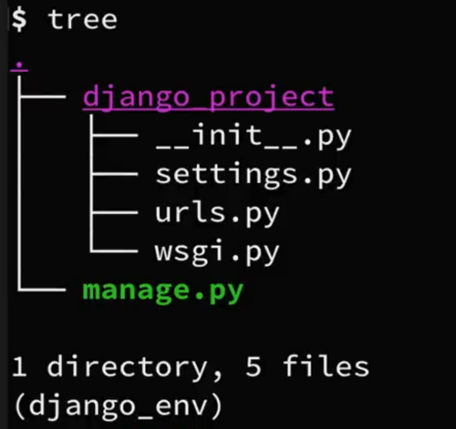

# Installation

Okay lets get started with learning how to build this application using django then lets pull up terminal, so first of start by showing __packages__ that we need to get started out, we can do this on a __virtual environment__ or on a _default python environment_ but it's always a good idea to separate different projects into the own virtual environments.

- [Installation](#installation)
  - [Django Module Installation](#django-module-installation)
    - [1. Need Packages](#1-need-packages)
    - [2. Install Django](#2-install-django)
  - [Create project](#create-project)
  - [To run the server](#to-run-the-server)


## Django Module Installation

1. Need Packages
2. Install Django

### 1. Need Packages

- If you need to install python.
- How to work with virtual environment.
- or wondering how to set-up my text-editor. I have videos check out them.

With that said Let's get started -

### 2. Install Django

So, first lesson __install django__ so to do this we can simply do -

```shell
pip install django
```
- It install successfully django but, to be sure check the django version.

```shell
python -m django --version
```

- Use __python 3.7__ or higher version otherwise some of the features might not work in previous versions. There are some features that we use through this series such as __F String__ that are only available if you are running python 3.6 or higher.

Now lets create a new __project__ from scratch. You can create your project anywhere you would like in your machine. So, to create new a project we going to use some command that are available to us provided by django. One of these command is __`django-admin`__ so if you type, it should shows available __sub commands__.

```shell
# List of sub commands
django-admin
```

- We can see a lot of different sub commands listed here, we will see couple of this letter in project. But we are going to use one right now called __`startproject`__.
- So `startproject`: will create a new django project here, that has a complete structure with different files and everything we need to get started. Let's do that -

## Create project

```shell
django-admin startproject django_project
```

- Use underscore instead of dash.
- So we created a new project called __django_project__.
- If you look on your file explorer or desktop, now you have a directory called `django_project`.
- Let look at the project structure what that `startproject` command just created for us. For that cd the directory inside the project.

```shell
cd django_project
```

- Now open this project in a code editor.
- Now lets look at the project structure that startproject command created for us.
- Or you can also view in terminal, Let me show structure in command line interface.

```shell
tree
```



```shell
.
|--- django_project
|     |-- __init__.py
|     |-- asgi.py
|     |-- settings.py
|     |-- urls.py
|     |-- wsgi.py
|
|--- manage.py
```

- Now we can see here in structure, that on base level we have a `manage.py` and a `django_project` directory.
- __`manage.py`__: is a file that allows us to run main line command & we don't want making any changes here.
- __`django_project`__: We also have a directory called `django_project` which is also the name that used in our project itself. Within this directory we have 5 different files.

1. __`__init__.py`__: It just an empty file. That just tells python this is just python package.
2. __`settings.py`__: Next we have `settings.py` as it tells probably by name, this where we can change different settings and configurations so we will be using this through out series or development.

We can see that most of this files have good documentation and links provided where we can learn more information. Now if you glance through here in `settings.py`.
   - __SECRETE_KEY__: That just add lots security enhancement to django. We also have __DEBUG__, __INSTALLED_APPS__, __DATABASE__ settings and all kinds of different useful settings that we will talk about more in future.

3. __`urls.py`__: This is where we will set up the mapping from certain urls to where we send the user.
4. __`wsgi.py`__: is how our python web application and web server will communicate.

Now let's open up default website in our browser. To open up website in browser, we have to run a command -

## To run the server

Stay with same directory where `manage.py` file is then run -

```py
python manage.py runserver
```

- You might have warning we will fix next time that says you have 15 unapplied migrations and that suggest to run command, let's not do that.

Now open in browser [http://127.0.0.1:8000/](http://127.0.0.1:8000/). Another name is [http://localhost:8000/](http://localhost:8000/).
- localhost = 127.0.0.1

This is the default website that django has created for us and in this series we will modify this.

`127.0.0.1` was the IP address of the local machine. And also there are alias for that IP address called as `localhost`.

- To stop the server by `ctr` + `c`.

In, __DEBUG__ mode it should automatically reload any changes that made to our code.
