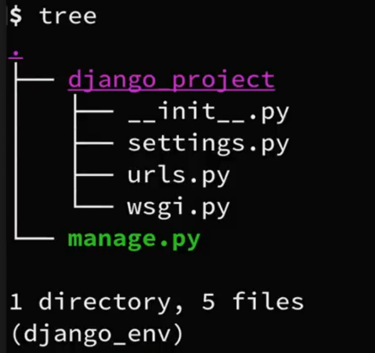

# Django Project

- Building a full feature application using django framework in python.

## Feature

- Blog style application where different users can write different posts (blog posts, twitter updates etc).
- Authentication system(log in).
- Register ( create new Account).
- Login (If already have account).
- Forgot Password(Reset Password by getting an email).
- Profile, update profile, update picture profile.
- View others people posts.
- Update/Delete posts by double verification.
- Work with databases &how to create an authentication (accepts user input from form and send emails to reset password etc).
- Access admin page/Nice interface.

## Need Packages

- Need to install python
- How to work with virtual environment.
- wondering how to set-up my text-editor. I have videos check out them.

### 1. Install Django

```shell
pip install django
```
- To be sure.

```shell
python -m django --version
```

- available commands provided by django.

```shell
# List of sub commands
django-admin
```

- Use `startproject`: will create a new django project here that has a complete structure with different files and everything we need to start in.
- To start project -

```shell
django-admin startproject django_project
```

- If you look on your file explorer now you have a directory called `django_project`.
- Let look at the project structure what that `startproject` command just created for us.

```shell
cd django_project
```

- Open a code editor.
- Now lets look at the project structure that startproject command created for us. Let me show structure in command line interface.

```shell
tree
```



```shell
.
|----django_project
|    |   __init__.py
|    |   settings.py
|    |
```

- Now we can see here in structure that on base level we have a manage.py and a `django_project` directory.
- `manage.py` is a file that allows us to run main line command & we don't want making any changes here.
- We also have a directory called `django_project` which is also the name that used in our project itself. Within this directory we have 5 different files.

`__init__.py`: It just an empty file. That just tells python this is just python package.
Next we have `settings.py` This where we have different change settings and configurations we will be using this through out series or development.

```py
# To run the server
python manage.py runserver
# you might have warning we will fix next time.
```

- localhost = 127.0.0.1

### Creating blog app

- we can have multiple app for a project  like blog app, store app.

```py
# creating blog app

python manage.py startapp blog

# or

django-admin startapp store
```

- write in `blog/views.py`:

```py
# importing 
from django.http import HttpResponse

# Create our views here.

def home(request):
    return HttpResponse('<h1>Blog Home</h1>')
```

- map the url in `/blog` create a new file `urls.py` and write -

```py
from django.urls import path

from . import views

urlpatterns = [
    # creating path for blog home page
    path('', views.home, name='blog-home'),
]
```